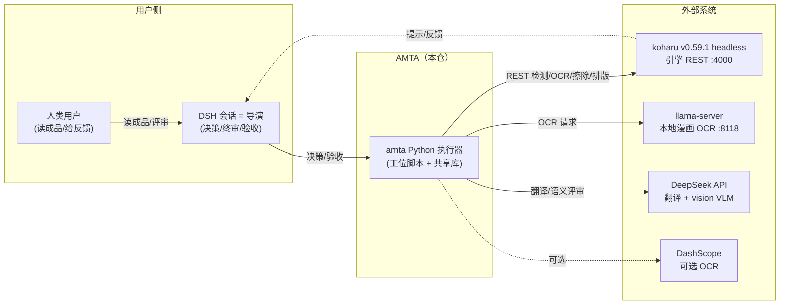
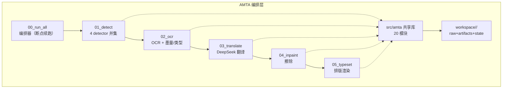
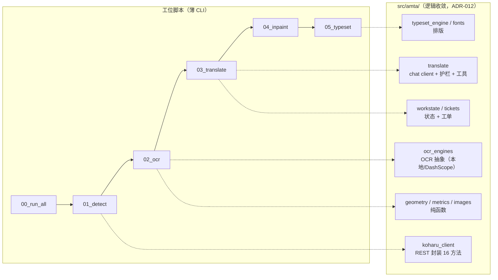

# AMTA 架构文档（C4 三视图）

> 生成方式：c4-codebase-architecture skill（从代码证据反推，观察/推断分离）。
> 日期：2026-08-27 · Scope：本仓（amta/）= **AMTA 编排层**，不含 koharu 本体（引擎是外部系统）。

## 1. Scope 声明

本仓库是漫画翻译自动化的**编排/执行层**（Python），不包含引擎实现：
- **amta/ 仓内**：工位脚本（00_run_all → 01_detect → 02_ocr → 03_translate → 04_inpaint → 05_typeset）+ 共享库（src/amta/）+ 状态（workspace/、state/）
- **仓外依赖**（外部系统）：koharu v0.59.1 headless（引擎，:4000）、本地 llama-server（OCR，:8118）、DeepSeek API（翻译/VLM）、DashScope（可选 OCR）、DSH 会话（导演）

## 2. 观察（Observed，来自代码）

- 入口：`scripts/00_run_all.py` 编排 6 个数字前缀工位脚本（断点续跑，文件存在=跳过）
- 共享库：`src/amta/` 20 个模块（koharu_client / pipeline / runner / ocr_engines / translate / workstate / tickets / geometry / metrics / inpaint_strategy / typeset_* 等）
- 状态：`workspace/<work_id>/{raw, artifacts, state}`，state 三件套（touhou_knowledge / work_state / open_questions）+ suggestions + failure_log + pipeline_log
- 外部端点（代码实测）：
  - koharu：`http://127.0.0.1:4000/api/v1`（REST）
  - llama-server：`http://127.0.0.1:8118/v1`（OpenAI 兼容 OCR）
  - DeepSeek：`.env` CHAT_BASE_URL（翻译 + vision-exp VLM 评审）
  - DashScope：`https://dashscope.aliyuncs.com/compatible-mode/v1`（可选 OCR）
- 依赖（第三方 import）：requests / PIL / uv（管理）——零其他运行时依赖（ADR-009/015/018）

## 3. 推断（Inferred）

- DSH 会话是**导演**：决策/翻译判断/修复决策/验收，通过 CLI 调用工位脚本（会话驱动架构，ADR-003/014）
- koharu 是**引擎**：检测/OCR/擦除/排版的原语执行者（REST + 像素 mask 机制）
- 数据流是**文件即状态**：工位间不共享内存，靠 artifacts/ JSON 传递（ADR-013/018）

---

## 4. System Context（系统上下文）

## 5. Container 视图（容器）

## 6. Component 视图（amta 容器内部）

## 7. 待澄清问题（Open Questions）

1. 03.5 语义评审（VLM 逐 region 四维评分）是独立脚本 `scripts/translate_semantic_check.py`，未进 00_run_all 主链（由导演按需触发）——是否应成为正式工位？（v2 计划 D11 讨论中）
2. v2 计划新增 02.5 audit / 02.6 repair 工位（两趟式），本图是 v2 前的现状视图。

## 8. 建议下一步

- v2 落地后更新本图（加 02.5/02.6 节点）
- 可补 Code 级视图（按需）
- 生成 `.mmd` 源文件便于复用（本文件内嵌即源）
