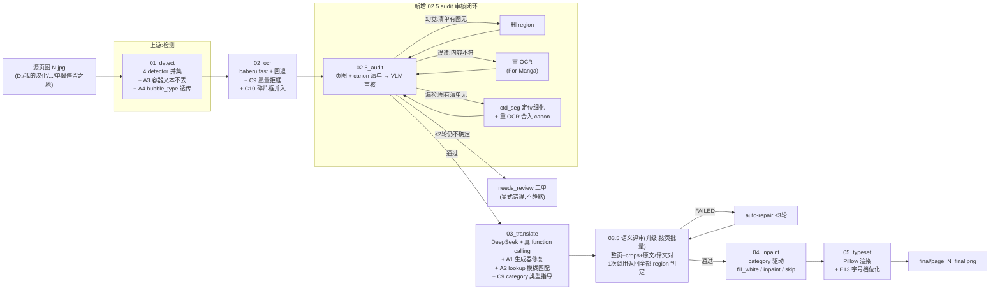

# AMTA 整改方案 + 新流水线（2026-08-27，Patrick 评审后）

> 来源：Patrick 对 11-20 翻译对照报告的人眼复审（5 类问题）+ 会话根因调查（systematic-debugging，crop/VLM 放大复核 + trace/产物取证）。
> 核心结论：问题几乎全在「检测+OCR」上游，翻译模型只是忠实翻译了错误输入。分三类：机械 bug（修一次不复发）、模型能力边界（换强模型/加验证层）、系统性缺口（无回环验证 → 静默错误一路流到成品）。

---

## 一、问题分类与根因

| # | 现象（Patrick 发现） | 根因 | 类别 |
|---|---|---|---|
| ① | そういうことで、×4 无中生有 | 检测器对页边装饰区（速度线/署名/网点）出假框，baberu 从噪声幻觉出整句（放大原图确认无此文字） | 机械（可拒框）+ 模型（幻觉） |
| ② | ビフン→哼！/ そよ→苏夜（SFX 当对白） | a) 4 detector 并集后 bubble_type 100% 全 dialogue（首引擎元数据覆盖）；b) 翻译 prompt 完全没传 category/类型指导 | 机械 + prompt |
| ③ | キョコ/エーマン/ハ意様 误读 | baberu 对艺术字弱；エーマン 是框落在ゴン大拟声词边缘碎片；八→ハ 系统性 | 模型边界 + 机械（碎片框） |
| ④ | 萨格姐姐/是陌生人/慌张语气 | a) suggestions 生成器把整句当术语译名（サグメ 词条被污染）；b) 无 サグ姉 词条且 lookup 不搜别名/模糊匹配，查询失败引导模型音译；c) prompt 无语气/场景指导；d) 评审 VLM 无整页上下文，风格问题全 5 分 | 机械（生成器/匹配）+ prompt |
| ⑤ | 混排气泡漏检（大字或小字必丢一个） | 4 detector 对混排气泡只出一条字号框；容器有 child 时容器自身文本在 flatten 被丢弃 | 系统性（检测能力 + 结构 bug） |

---

## 二、整改清单（按依赖排序，每项先写测试）

### A. 机械 bug 修复（半天量）

| ID | 问题 | 整改 | 验证 |
|---|---|---|---|
| A1 | suggestions 生成器把整个 region 译文存为术语译名（サグメ="说起来，探女你在做什么研究？"） | 生成器加守卫：译文长度 > 12 字或含句末标点/谓语 → 不产生 suggestion；一次性清洗污染词条（清垃圾 ≠ 硬编码塞词条，术语库只从审核确认结果回写） | 单测：长句不产出 suggestion；污染数据迁移脚本 dry-run |
| A2 | lookup_term 精确匹配失败 → "未找到" → 模型被引导音译（サグ姉様→萨格） | 未命中时模糊匹配：部分包含/前后缀匹配（サグ姉様 命中 サグメ 词条）→ 返回"无精确词条，但同角色 サグメ=探女（confirmed）"；同时搜 characters 别名 | 单测：サグ姉様/サグ姉 命中提示；trace 断言模型拿到提示 |
| A3 | 容器有 child_lines 时，flatten 只发 child，容器自身文本丢失 | 容器有 child 时，把容器 bbox 减去 child 合并区后的剩余区域也出框 OCR（或容器整体出框，OCR 时排除 child 已识别文本） | 回归：混排气泡大字/小字都进 canon |
| A4 | bubble_type 并集透传：union 保留首个引擎（pp-doclayout）元数据，后续引擎的 sfx/overlay 信息全丢 | union_blocks 按引擎优先级合并元数据：首引擎无 bubble_type 或为 unknown 时，取其他引擎的类型；最终多数投票 | 单测：合成 4 引擎输出 → 类型正确 |

### B. 02.5 audit 工位（新增，核心防地鼠）

| ID | 内容 | 说明 |
|---|---|---|
| B1 | 页图 + canon 清单 → VLM 审核 | 每页 1 次 VLM 调用（整页图 + 本页所有 OCR 文本清单），prompt：图上有哪些文字、清单里哪些图上没有、图上有而清单缺的 |
| B2 | 差异三分类自动闭环 | 幻觉（清单有图无）→ 删 region；误读（图有清单也有但内容不符）→ For-Manga 重 OCR；漏检（图有清单无）→ VLM 给大致区域 + ctd_seg 细化定位 → 重 OCR → 合入 canon |
| B3 | 闭环上限 ≤2 轮 | 2 轮后仍不确定 → needs_review 工单（显式错误，不静默） |
| B4 | 接入 00_run_all | 02_ocr 之后、03_translate 之前；02 产物变化时自动重跑 |

### C. 分类与翻译指导

| ID | 内容 | 说明 |
|---|---|---|
| C8 | category 修复落地 | 依赖 A4；02_ocr 的 canon 带正确 category |
| C9 | translate prompt 加类型指导 | system 提示：sfx→译成中文拟声词（不音译）；aside/小字→轻声补充语气；overlay→短标注；对白→自然口语。同时 02 加墨量拒框（墨量 <1% 直接跳过 OCR，挡住 ① 类假框的 OCR 成本） |
| C10 | 碎片框拒检 | bbox 与同页大框重叠且面积 < 大框 15% → 并入大框重新 OCR（挡 ゴン 碎片误读） |

### D. 语义评审升级（回应"评审是否多余"）

| ID | 内容 | 说明 |
|---|---|---|
| D11 | 评审上下文升级（按页批量） | 每页 1 次调用：整页图 + 本页全部 crop（多图/拼图）+ 全部原文/译文对 → VLM 一次返回所有 region 的判定 JSON。整页上下文让它能评语气/场景/术语一致性（当前 是陌生人/慌张 全 5 分）。调用量：每页 2 次视觉调用（audit 1 + 评审 1），41 页全书约 82 次，比现状逐 region 调用（11 次/页）更省 |
| D12 | 分工明确 | 02.5 audit 管"原文对不对"，03.5 评审管"译文好不好"；audit 后 accuracy 维度才可信。不砍评审：auto-repair 闭环依赖它，且曾抓出 page_9 主语错 |

### E. 渲染质量修复（Patrick 初审否决项）

| ID | 内容 |
|---|---|
| E13 | 字号档位化（12/16/20/24/28/36/48/52）替代连续二分；译文居中校验、不重叠；overlay 竖排锚点微调。放 category 修复后做（SFX 不再白底直填后观感先好一半） |

### F. 验证与收尾

| ID | 内容 |
|---|---|
| F14 | fastcheck 全绿（新增 audit/守卫测试）→ 11-20 全量重跑（audit 介入）→ 页 13 两条 inconclusive 复核 → 合并 main（feat/contract-hygiene，fetch→rebase 铁律） |

---

## 三、新流水线（01 → 02 → 02.5 → 03 → 03.5 → 04 → 05）

### 审核闭环说明（B1-B3）

1. 输入：整页原图 + 本页 canon 文本清单（02 产物）
2. VLM 输出：页上文字清单（含大致区域）+ 不确定项
3. 差异三分类：
   - **幻觉**：清单有、图上无 → 删除该 region（挡 ①）
   - **误读**：双方都有但内容不符 → For-Manga 重 OCR（挡 ③）
   - **漏检**：图上有、清单无 → VLM 大致区域 + ctd_seg 细化 → 重 OCR → 合入（挡 ⑤）
4. 闭环 ≤2 轮；仍不确定 → 工单，不静默放行（目标：零静默错误）

---

## 四、执行顺序

A（机械 bug，半天）→ B（02.5 audit）→ C（分类+prompt）→ D（评审升级）→ E（渲染）→ F（全量重跑+合并）

每步独立可验证：先写失败测试 → 修复 → fastcheck 全绿 → 提交。
